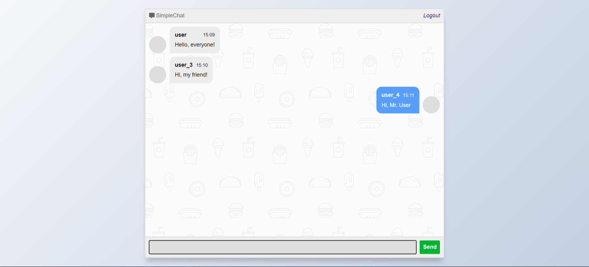

# Простой веб-чат на Flask

## О проекте

Проект представляет собой веб-приложение чата, разработанное с использованием Flask, SQLAlchemy и Flask-Login. Он позволяет пользователям общаться в реальном времени через веб-интерфейс.

### Возможности проекта

1. **Аутентификация и регистрация:** Пользователи могут создавать учетные записи и входить в систему с помощью своих имен и паролей. Это обеспечивает безопасный доступ к чату.

    

2. **Обмен сообщениями:** Зарегистрированные пользователи могут отправлять текстовые сообщения в общий чат. Сообщения отображаются в реальном времени без необходимости перезагрузки страницы.

    

3. **Отображение истории сообщений:** В чате отображается история предыдущих сообщений, что позволяет пользователям просматривать их при необходимости.

4. **Безопасность паролей:** Пароли пользователей хранятся в зашифрованном виде в базе данных, что обеспечивает безопасность их личной информации.

5. **Удобный интерфейс:** Проект имеет интуитивно понятный и привлекательный интерфейс, что делает его удобным в использовании для пользователей различного уровня опыта.

### Преимущества проекта

1. **Простота использования:** Пользователи могут легко зарегистрироваться, войти и начать общение в чате без необходимости дополнительной настройки.

2. **Реальное время:** Система чата обеспечивает мгновенную передачу сообщений между пользователями, что делает общение более эффективным и удобным.

3. **Масштабируемость:** При необходимости проект можно легко расширить или изменить, добавив новые функции или улучшив существующие.

4. **Обучение и развитие:** Проект может использоваться как учебный материал для изучения различных аспектов веб-разработки, таких как работа с базами данных, аутентификация пользователей и обработка запросов.

5. **Практическое применение:** Чат может быть использован для реального общения и взаимодействия между пользователями, что делает его полезным инструментом для коммуникации в различных сценариях, от образовательных до бизнес-целей.


## Установка

1. Клонировать репозиторий:

    ```bash
    git clone https://github.com/username/project.git
    ```

2. Установить зависимости:

    ```bash
    pip install -r requirements.txt
    ```

## Запуск

1. Перейти в директорию проекта:

    ```bash
    cd project
    ```

2. Запустить приложение:

    ```bash
    python app.py
    ```

## Использование

1. Открыть браузер и перейти по адресу [http://localhost:2025](http://localhost:2025).

2. Можно зарегистрироваться или войти под существующим именем пользователя.

3. Использовать чат для общения.

## Структура проекта

- `app.py`: Основной файл приложения.
- `templates/`: Шаблоны HTML.
- `static/`: Статические файлы (например, CSS, JavaScript).
- `requirements.txt`: Список зависимостей Python.